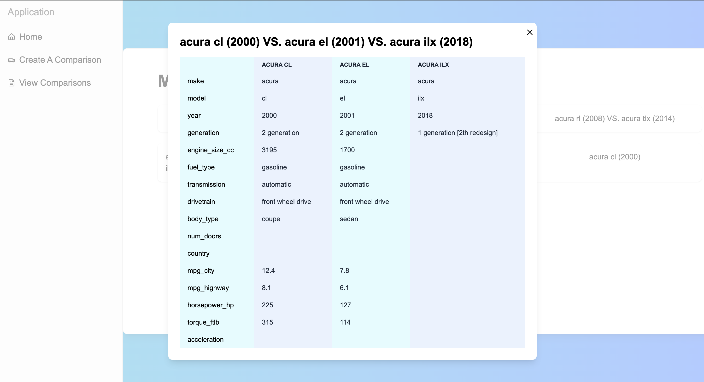

# ECE 1724 Final Project

## Team Information

Liu Linhao | linhao.liu@mail.utoronto.ca | 1003242573
Chen Hao Gao | chenhao.gao@mail.utoronto.ca | 1005239877
Jiawei Chen | jasonjiawei.chen@mail.utoronto.ca | 1005983018

## Motivation

#### Problem and needs

A car is crucial and necessary in North America, however car buyers often hesitate to choose between numerous car models. One major reason is that consumers often fail to handle overwhelming amounts of information from car trade websites, manufacturers and sellers. Besides, it’s hard for them to verify the correctness of this information, most of which come from people who try to make more profit instead of selling the correct car.

#### Why worth pursuing

A third-party, non-profit car model comparison platform can help users make better purchasing decisions by providing clear and correct information. This project does address a real issue, and can potentially attract a significant user base.

#### Target user

First-time car buyers, car enthusiasts, car dealers, car youtubers, those who look for cars for alternative purposes, and those who want to upgrade their existing vehicle.

#### Existing solutions and their limitations

We do find some existing websites that satisfy our goal. E.g, [car trader](https://www.autotrader.ca/research/comparison), [edmunds](https://www.edmunds.com/car-comparisons) and [cars](https://www.cars.com/research/compare/). There are several limitations we can think of.

1. They come from car sellers.
2. Many cars have missing data
3. No customer review or only a few customer reviews, which makes it hard to evaluate the real driver experience.
4. Crowded with ads
5. Lack of customization

## Objectives

Develop a user-friendly car model comparison platform that allows users to easily compare different car models based on various criteria. The platform should include detailed, up-to-date information on cars, and provide smooth and intuitive user experience.

## Technical Stack

Express.js back-end and React front-end. Use prisma as database solution with PostgreSQL, and jwt library for user authentication and authorization. Google Cloud was used for cloud storage.

## Features

1. The user can register and login to the platform. The account allows the user to save previous comparisons.
2. The user can write a review and grade a car model. For each car model, the user can also see an overall grade and reviews from other users.
3. The user can choose arbitrary multiple (at most four) cars to compare at the same time.

### Fulfillment of course requirements

We use tech stacks that satisfy the core technical requirements.
This project requires front-end design, API interpretation, file storage and database management, with user authentication and authorization, which cover major topics we learned from this course.

## User Guide

### Home page

- Route /
- A general introduction page
  

### User register

- Route /register:
  
- Provide all information and click 'Sign Up' button
  Note:

  - **username**: non-empty string, 3-15 characters length, allows a-z, A-Z, 0-9, ".", "-" and "\_". E.g, "vAlid-User_Name" is valid, "User?Na/Me" and 'a' are invalid. Duplicate username is not allowed

  - **email**: use a simpler regex to validate: /\^[a-zA-Z0-9._-]+@[a-zA-Z0-9.-]+\.[a-zA-Z]{2,6}$/

  - **password**: 8-20 characters length, includes 1+ uppercase, 1+ lowercase, 1+ number. All symbols are allowed.

- Once all information is valid, success dialog will show and redirects to login page.
  

### User login

- Route /login:
  
- If credential is correct, user will be redirected to profile page.

### User profile

The page only shows user name, email and number of likes.

- Main pages
- The left side bar directs the user to multiple features:
  - Home: redirect to /
  - Create a Comparison: redirect to /choose
  - View comparisons:
  - Reviews:

### Create a comparison

- User can choose at most 4 cars to compare. Use filter to filter out cars in the list. Click the car card will should details of a car.

- Click 'Selected Cars' button on the top can show the list of selected cars, and user can create the comparison from the modal.

- Once a comparison is created, the user will be redirected to the comparison page which displays the metrics for each car selected in a side-by-side table.

- Click the 'Save' button from the comparison page to save this comparison. All saved comparisons are saved in the comparisons list page, and individual comparison can be brought up by clicking the title.

## Development Guide

Makefile is included in both back-end and front-end.

Note: For the first time of deployment, run `make import` to load car data into database.

### Back-end:

- Environment setup and configuration: `make install`
- Database initialization: `make init_db`
- Local development: `make run`
- Testing: `make test`

### Front-end:

- Environment setup and configuration: `make install`
- Local development: `make run`
- Testing: `make test`

## Individual Contributions

### Linhao Liu

- All API implementation
- Fix errors and part of database operations
- All back-end unit tests
- Front-end home page, login page, registration page and profile page.
- API interpretation on comparison page.
- Front-end mock test for home page, login page and register page.
- Project proposal
- Car data load and import script
- Cloud storage deployment for car images
- Major part of final report

### Chen Hao (Andy) Gao

- Prisma schema setup
- Most Database Validations and Operations
- Front-end context for Comparisons Cart to be used by multiple pages
- Front-end comparisons page (table), comparisons list page
- Proofreading and adding additional details to the final report's User Guide section

## Lessons Learned and Concluding Remarks

### Lessons learned

- Document matters
  Clear communication among developers, designers, and between front-end and back-end is important. Write doc carefully and read doc before starting the development can save our time and maintain consistency.
- Testing ensures code quality
  Unit tests and mock interpretation on front-end ensures all cases are correctly handled without heavy manual work.
- Not reinvent the wheel
  Tailwind-css and shadcn release developers from endless style adjustment and commonly used component implementation.

### Final thoughts

Since we lost two weeks for the project timeline, we don't have the opportunity to fully test everything and improve our project. There're still many things I can think of to develop for stability and better user experience.

- Username and password change
- Share a comparison
- Improve front-end design: more attractive home page, animation and shading, button size, color and text design and so on.
- OAuth
- Reply to a review
- User avatar
- Support page
- Code refactor and performance optimization
- Features that are listed under Bonus Points in project requirement.
